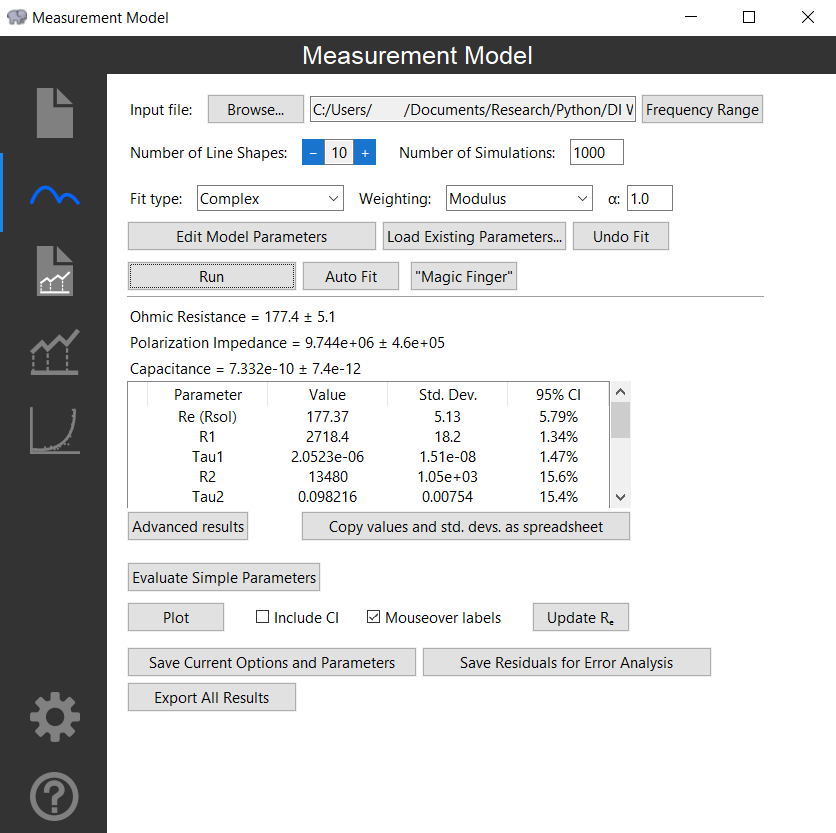

# Measurement Model
A GUI Python-based impedance measurement model tool. This project served as my University of Florida honors thesis. A version is availabe at ECSarXiv: [EIS: Measurement Model Program](https://osf.io/preprints/ecsarxiv/kze9x/kze9x_v1). This tool has also been referenced in published literature: [Physical properties obtained from measurement model analysis of impedance measurements](https://www.sciencedirect.com/science/article/abs/pii/S0013468620311403) by H. Liao, W. Watson, et. al.

**Note:** The quality of the code isn't the best but it does the job. If I was writing this again there's a lot I would do differently!

## How to use
_mm.py_ is the program launching point.  
_Measurement_model_guide.pdf_ is a very in-depth look at the program's abilities.  

## Features
### Importing data
* Read common impedance file types and automatically select the data contained therein
* Delete data as desired
### Fitting measurement model
* Fit impedance data to a series of RC elements with the specified fitting type and weighting
* Auto-fit data
* Undo previous fits
* Change frequency range dynamically
* Refine initial guesses graphically or through "multistart"
* Evaluate simple extrapolated parameters
* View and export detailed results, including Monte Carlo confidence intervals and result correlation matrix
* View and save interactive graphical results
### Fitting custom formulas
* Fit impedance data to an arbitrary custom formula written in Python in-program
* Save custom formulas with descriptions and Latex-based equations
* Generate synthetic data from custom formulas
* Change frequency range dynamically
* Refine initial guesses through "multistart"
* View and export detailed results, including Monte Carlo confidence intervals and result correlation matrix
* View and save interactive graphical results
##### Error analysis
* Save residual errors from a fitting and combine them
* Use combined errors to fit an error structure
##### Settings
* Change default settings for ease-of-use and appearance
